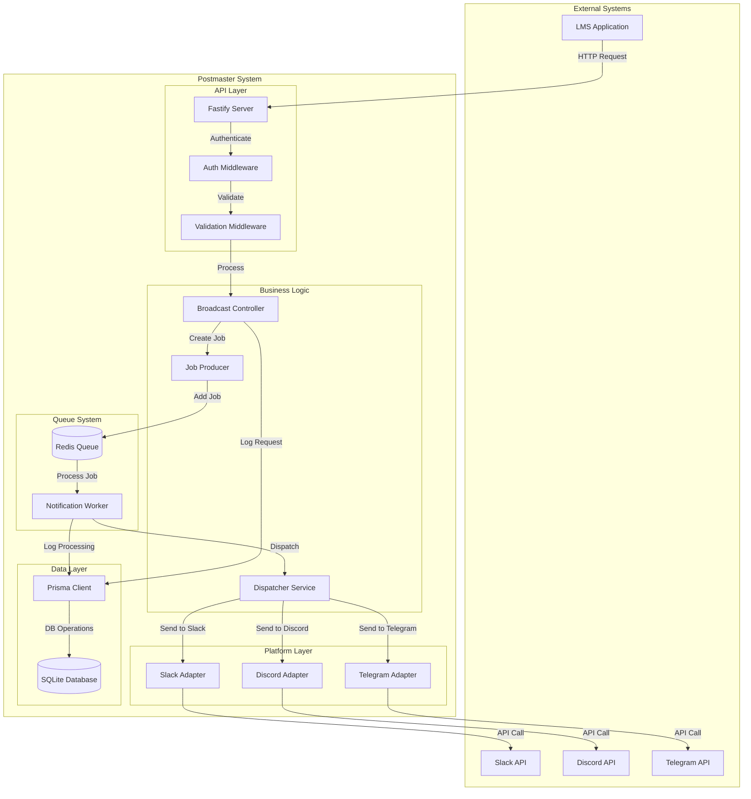
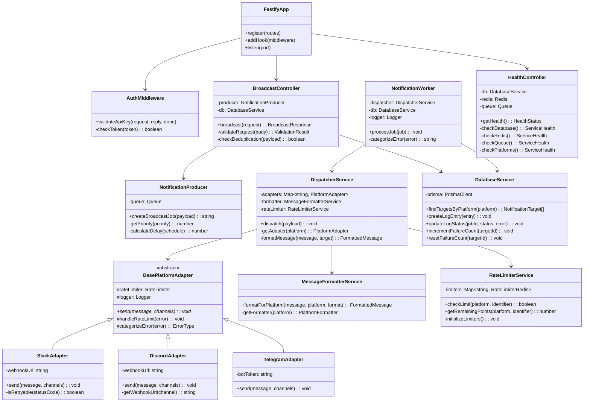
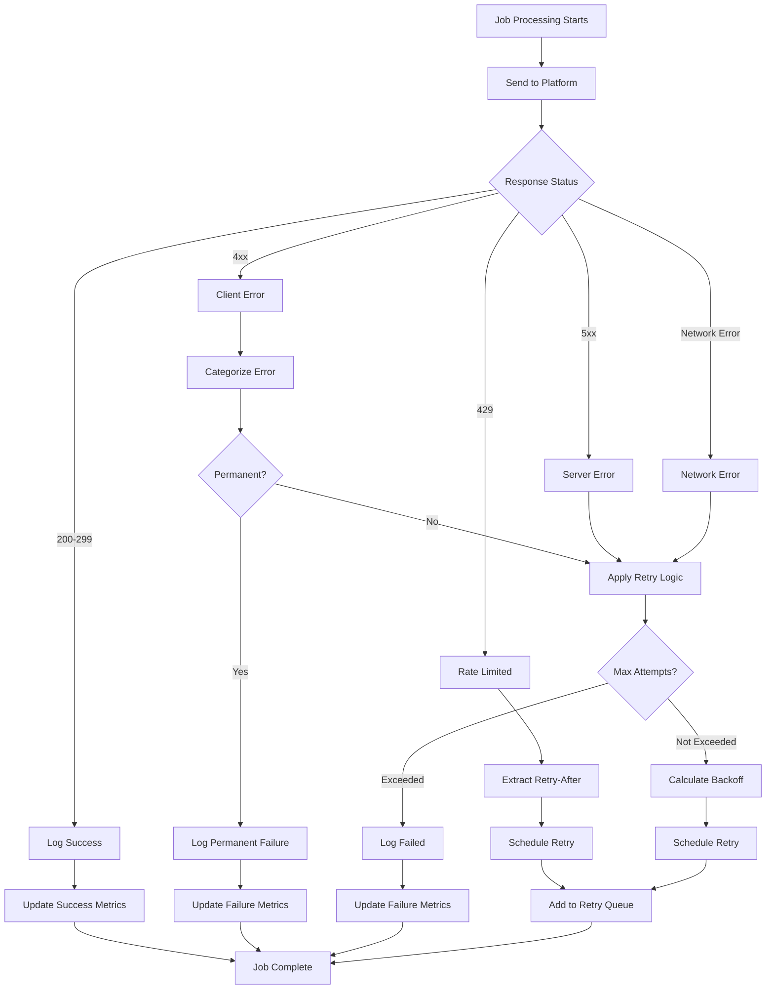
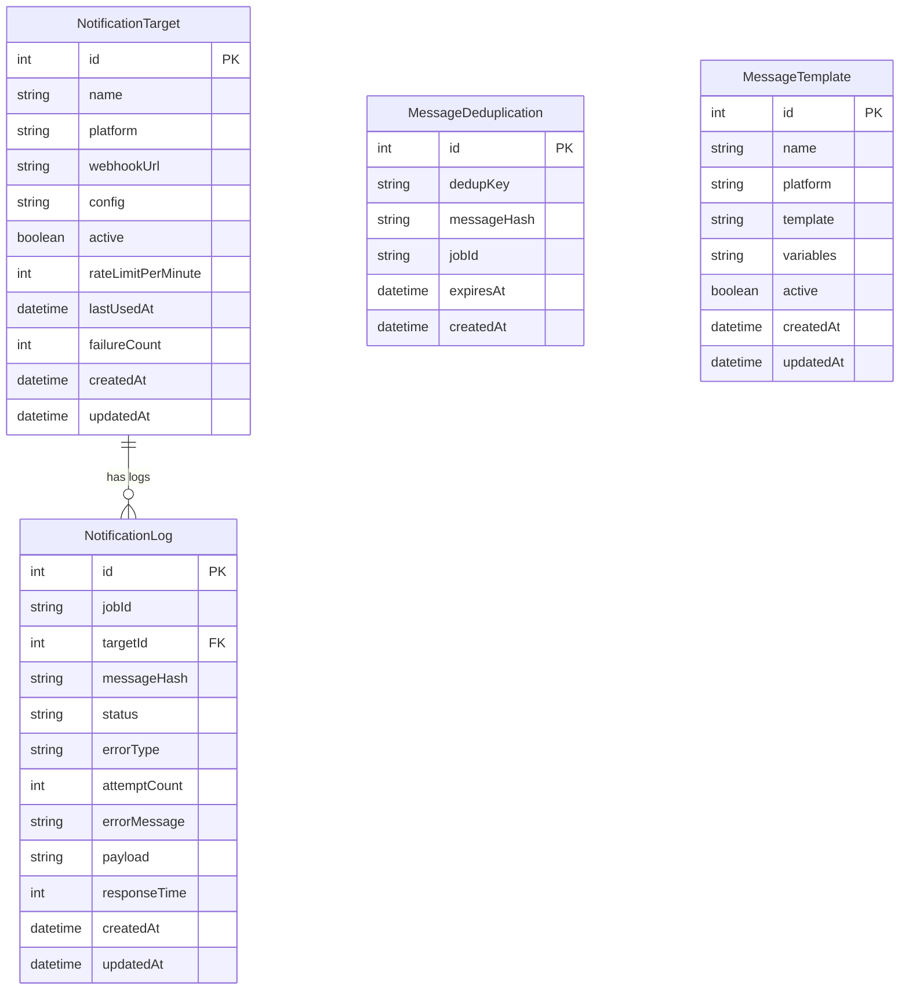
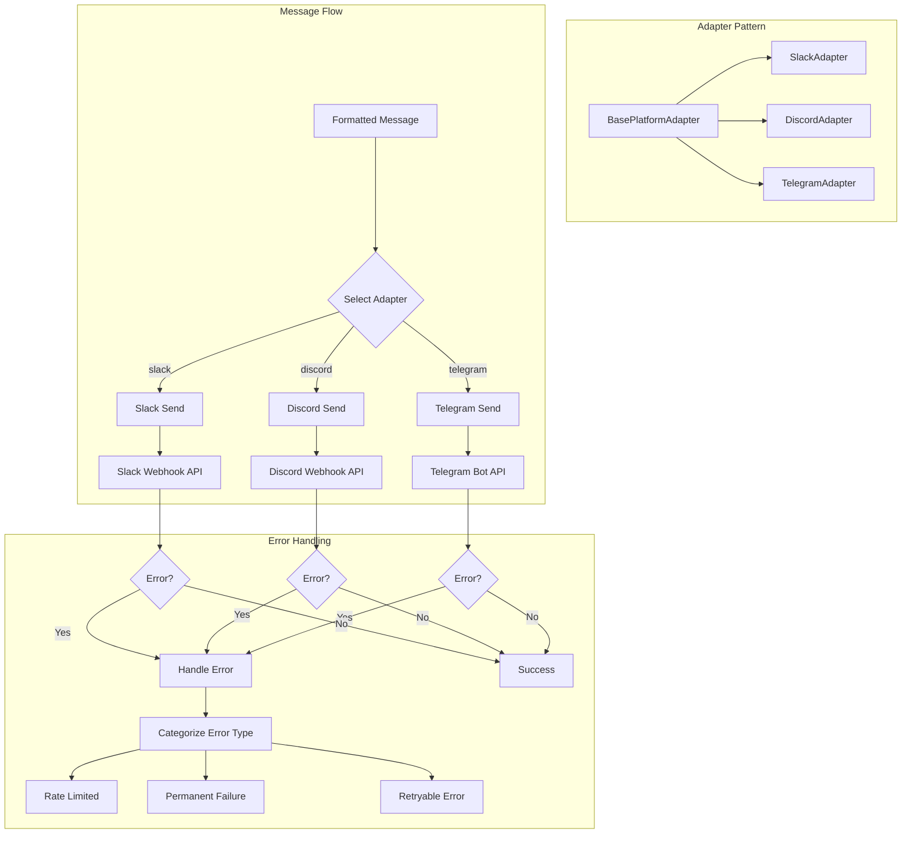

# Postmaster Execution Flow & Architecture

This document provides visual representations of how the Postmaster system works, including class relationships, API execution flow, and data flow patterns.

## Table of Contents
1. [System Architecture Overview](#system-architecture-overview)
2. [Class Diagram](#class-diagram)
3. [API Request Flow](#api-request-flow)
4. [Job Processing Flow](#job-processing-flow)
5. [Error Handling Flow](#error-handling-flow)
6. [Database Interaction Flow](#database-interaction-flow)
7. [Platform Adapter Flow](#platform-adapter-flow)

## System Architecture Overview



## Class Diagram



## API Request Flow

```mermaid
sequenceDiagram
    participant LMS as LMS Application
    participant API as Fastify Server
    participant AUTH as Auth Middleware
    participant CTRL as Broadcast Controller
    participant PROD as Job Producer
    participant REDIS as Redis Queue
    participant DB as Database
    
    LMS->>+API: POST /api/v1/broadcast
    Note over LMS,API: Authorization: Bearer <api_key>
    
    API->>+AUTH: Validate Request
    AUTH->>AUTH: Check API Key
    alt Invalid API Key
        AUTH->>-API: 401 Unauthorized
        API->>-LMS: Error Response
    else Valid API Key
        AUTH->>-API: Continue
        
        API->>+CTRL: Process Broadcast Request
        CTRL->>CTRL: Validate Payload
        
        alt Invalid Payload
            CTRL->>-API: 400 Bad Request
            API->>-LMS: Validation Error
        else Valid Payload
            CTRL->>+DB: Check Deduplication
            DB->>-CTRL: Deduplication Result
            
            CTRL->>+PROD: Create Broadcast Job
            PROD->>+REDIS: Add Job to Queue
            REDIS->>-PROD: Job ID
            PROD->>-CTRL: Job Created
            
            CTRL->>+DB: Log Job Creation
            DB->>-CTRL: Log Saved
            
            CTRL->>-API: Success Response
            API->>-LMS: 200 OK with Job ID
        end
    end
```

## Job Processing Flow

```mermaid
sequenceDiagram
    participant REDIS as Redis Queue
    participant WORKER as Notification Worker
    participant DISP as Dispatcher Service
    participant RATE as Rate Limiter
    participant ADAPTER as Platform Adapter
    participant PLATFORM as External Platform
    participant DB as Database
    
    REDIS->>+WORKER: Process Job
    WORKER->>+DB: Log Job Start
    DB->>-WORKER: Logged
    
    WORKER->>+DISP: Dispatch Message
    
    loop For Each Target Platform
        DISP->>+RATE: Check Rate Limit
        RATE->>-DISP: Rate Limit OK
        
        DISP->>DISP: Format Message
        DISP->>+ADAPTER: Send Message
        
        ADAPTER->>+PLATFORM: HTTP Request
        alt Success Response
            PLATFORM->>-ADAPTER: 200 OK
            ADAPTER->>-DISP: Success
        else Rate Limited
            PLATFORM->>-ADAPTER: 429 Too Many Requests
            ADAPTER->>ADAPTER: Extract Retry-After
            ADAPTER->>-DISP: Rate Limit Error
        else Server Error
            PLATFORM->>-ADAPTER: 5xx Error
            ADAPTER->>-DISP: Retryable Error
        else Client Error
            PLATFORM->>-ADAPTER: 4xx Error
            ADAPTER->>-DISP: Permanent Error
        end
    end
    
    DISP->>-WORKER: Dispatch Complete
    
    alt All Platforms Failed
        WORKER->>+DB: Log Failure
        DB->>-WORKER: Logged
        WORKER->>-REDIS: Throw Error (Retry)
    else Success or Partial Success
        WORKER->>+DB: Log Success
        DB->>-WORKER: Logged
        WORKER->>-REDIS: Job Complete
    end
```

## Error Handling Flow



## Database Interaction Flow



## Platform Adapter Flow



## Data Flow Summary

### 1. **Request Ingestion**
- LMS sends HTTP request to Postmaster API
- Authentication middleware validates API key
- Request validation ensures payload correctness

### 2. **Job Creation**
- Broadcast controller processes the request
- Deduplication check prevents duplicate messages
- Job producer creates a queue job with retry configuration

### 3. **Queue Processing**
- Redis queue stores jobs with priority and scheduling
- Notification worker picks up jobs for processing
- Worker handles job lifecycle and error scenarios

### 4. **Message Dispatching**
- Dispatcher service coordinates message delivery
- Rate limiter prevents API abuse
- Message formatter adapts content for each platform

### 5. **Platform Delivery**
- Platform adapters handle platform-specific logic
- HTTP requests sent to external APIs (Slack, Discord, Telegram)
- Response handling and error categorization

### 6. **Logging & Monitoring**
- Database logs all job attempts and outcomes
- Metrics collection for monitoring and alerting
- Health checks ensure system reliability

## Key Design Patterns Used

1. **Adapter Pattern**: Platform adapters abstract different API implementations
2. **Producer-Consumer**: Queue-based job processing
3. **Strategy Pattern**: Different message formatters for different platforms
4. **Chain of Responsibility**: Middleware pipeline for request processing
5. **Template Method**: Base adapter defines common error handling flow
6. **Observer Pattern**: Metrics collection and logging throughout the system

This architecture ensures:
- **Reliability**: Queue-based processing with retries
- **Scalability**: Horizontal scaling through queue workers
- **Maintainability**: Clean separation of concerns
- **Extensibility**: Easy to add new platforms via adapter pattern
- **Observability**: Comprehensive logging and monitoring
